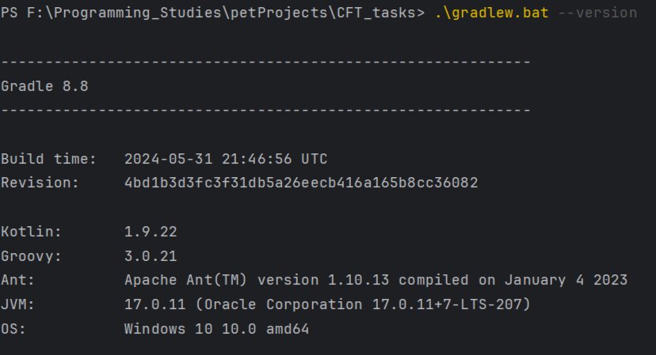

## Описание решения
### Структура и описание классов
Утилита представляет собой решение, состоящее из 7 классов. <br>
#### Пакет parameters: <br>
```java
import com.beust.jcommander.Parameter;
import lombok.Getter;
import parameters.validators.InputFileValidator;

import java.util.ArrayList;
import java.util.List;

@Getter
public class DataFiltersParams {
    @Parameter(description = "Input files for further filtering", validateWith = InputFileValidator.class)
    private List<String> inputFiles = new ArrayList<>();
    @Parameter(names = "-o", description = "Output path for filtered files")
    private String outputPath = "./output";
    @Parameter(names = "-p", description = "prefix for filtered files")
    private String prefix;
    @Parameter(names = "-a", description = "append mode")
    private boolean appendMode = false;
    @Parameter(names = "-s", description = "short statistics")
    private boolean shortStats = false;
    @Parameter(names = "-f", description = "full statistics")
    private boolean fullStats = false;
}
```
* DataFilterParameters - класс, для хранения и обработки параметров и опций командной строки, <br>
реализованный при помощи библиотеки JCommander. <br>
#### Пакет parameters.validators:
Также в подпакете validators лежат вспомогательные классы-валидаторы для валидации этих самых параметров и опций: <br> 
* ExclusiveStatsValidator - отвечает за валидацию взаимоисключаемых опций. <br> 
В контексте задачи это параметры -s и -f. <br>
* InputFileValidatior - валидирует входящие файлы <br>
* OutputPathValidator - валидирует путь для вывода результирующих файлов, заданной опцией -o. По-умолчанию <br>
результирующие файлы генерятся в папке output. 

#### пакет services:
* StatisticsCollector - класс-синглтон, отвечающий за сбор статистических данных. <br>
Имеет методы для обновления и вывода текущей статистики.
* DataFilterProcessor - основной класс по обработке и фильтрации входящих файлов. <br>
Вызывает методы ранее описаных классов.

#### пакет main
* Main - основной класс-медиатор. Точка запуска утилиты

### Система сборки и версия Java
Необходим Gradle 8.8 и Java 17 <br>


### Зависимости 
```groovy
dependencies {
    testImplementation platform('org.junit:junit-bom:5.11.0') // тестирование (не использовалось)
    testImplementation 'org.junit.jupiter:junit-jupiter'

    compileOnly 'org.projectlombok:lombok:1.18.34' // генерация шаблонного кода
    annotationProcessor 'org.projectlombok:lombok:1.18.34'

    implementation 'com.beust:jcommander:1.82' // работа с командной строкой
    implementation 'org.apache.logging.log4j:log4j-core:2.24.1' // логирование 
}
```

### Логирование
Для логирования используется log4j2. Логи выводятся в консоль, также записываются в logs/task1.log. <br>
Конфигурационный файл log4j2.xml лежит в папке resources.

